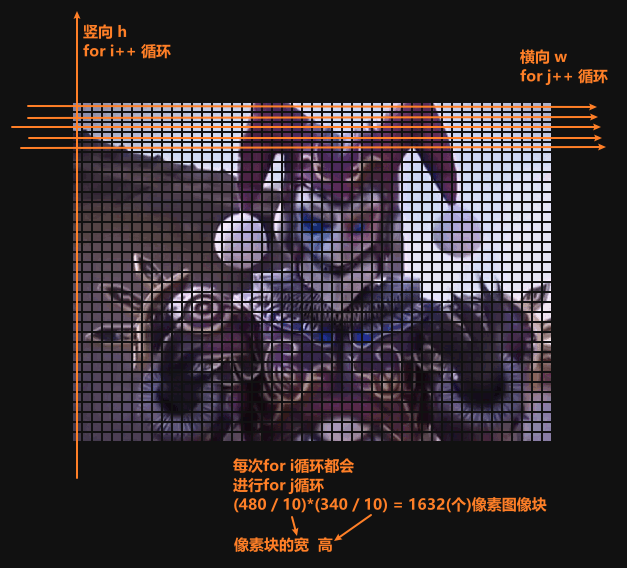

## 【像素化图像】一定要铠甲才能让你兴奋吗？看好了我可不是铠甲勇士
## 使用HTML、CSS和Javascript 创造图片像素化动画效果

## 💻
在本篇文章中将介绍如何通过使用HTML、CSS和JavaScript创建大把**awesome**像素图像动画效果。这个动画效果会动态的逐渐显示一个由多个很多像素图像组成的图片，并对像素图像应用关键帧动画效果还设置了每个像素图像的不同延迟时间来实现整体的动态效果；

## 筑基🪵 - 筑造HTML基础
首先，让我们构建起`HTML`结构的基础，为即将制作的像素图像动画铺平道路：
  * 在这个HTML文档中，我们引入了一个外部的CSS文件 `style.css` 和一个外部的JavaScript文件 `index.js`；
  * 同时，我们定义了一个包含 `class="box" 的 <div>` 元素作为包裹内容容器，并在其中创建了一个 `id="pixel" 的 <div>` 元素，用于承载我们的每一个像素图像；
    ```html
    <!DOCTYPE html>
    <html lang="en">
    <head>
      <meta charset="UTF-8">
      <meta name="viewport" content="width=device-width, initial-scale=1.0">
      <title>Pixel Image Animation</title>

      <link rel="stylesheet" href="./style.css">
    </head>
    <body>
      <div class="box">
        <div id="pixel"></div>
      </div>
      
      <script src="./index.js"></script>
    </body>
    </html>
    ```

## 练体⚒️ - 创建CSS样式
像素图像的动画将通过CSS动画来实现。下面是`style.css`中的样式代码，用于定义像素图像动画的样式：
  * 首先对所有元素应用了一些基本的样式重置，然后定义了一些CSS变量来控制盒子和像素图像的尺寸；
  * 在 `.box` 类选择器中，将容器设置为相对定位，并使用 `--box-w` 和 `--box-h` 这两个CSS变量来定义它的宽度和高度；
  * 在 `.box span` 类选择器中，将每个像素元素设置为绝对定位，并使用 `--pixel-w-h` 这个CSS变量来确定每个像素的宽高，为像素元素设置了背景图片->此时称为**像素图像**，动画效果等像素元素创建完后再添加；
    ```css
    * {
      margin: 0;
      padding: 0;
      box-sizing: border-box;
    }

    :root {
      --box-w: 480px;
      --box-h: 340px;
      --pixel-w-h: 10px;
    }

    body {
      display: flex;
      justify-content: center;
      align-items: center;
      min-height: 100vh;
      background-color: #111;
    }

    .box {
      position: relative;
      width: var(--box-w);
      height: var(--box-h);
    }
    .box span {
      position: absolute;
      width: var(--pixel-w-h);
      height: var(--pixel-w-h);
      background-image: url(./logo.jpg);
      background-repeat: no-repeat;

      /* animation: animate 10s linear infinite;*/
    }
    ```

## 武学🪄 - JavaScript魔法
首先需要想一下需要多少个像素块铺满整个`内容区域`(创建多少个像素块)？
  * 当然，这取决于内容区域的大小(宽高)，而内容区域的尺寸取决于图片的大小。比如：这里使用的是`480x340`的图片尺寸；
  * 每个像素块的大小通过前面设置的css已经决定了，这个无非是密度多与少的问题，块越小密度越大(密密麻麻)，块尺寸越大密度越小(稀稀拉拉)。比如：这里使用的是`10x10`(刚刚好好)前提是图片的尺寸是`300x300`宽和高同等时看上去更加立体，总之块尺寸还是依赖于图片尺寸的；
那么这里就是需要`(480/10) * (340/10) = 1632`个像素块；

接下来的这段JavaScript代码的主要功能是创建一个个像素块，然后在页面上生成一系列位于不同位置的`<span>`元素，这些元素在不同的延迟时间后逐个显示，从而形成一个逐渐显现的像素化图像。具体分析如下：
  1. **常量定义：**
    - `IMG_W` 和 `IMG_H` 定义了图像的宽度和高度，分别为480x340；
    - `PIXEL_W_H` 定义了每个像素块的宽度和高度，为10；
  2. **变量计算：**
    - `h` 计算了图像高度除以像素高度，以确定生成多少组像素块。比如这里是：`Math.ceil(IMG_H / PIXEL_W_H)`(组)；
    - `w` 计算了图像宽度除以像素宽度，以确定每组生成多少个像素块。比如这里是：`Math.ceil(IMG_W / PIXEL_W_H)`(个)；
    - 这里向上取整的原因，是因为如果出现**小数**的情况下就**多渲染一组span元素，**避免像素图像显示不完整；
  3. **嵌套循环：**
    - 外层循环遍历一条纵向组，即图像的高度上分成多少组。比如这里是：`34`组；
    - 内层循环遍历每组内的横向像素块，即每组生成多少个像素块。比如这里是：`48`个；
    - 每一次for i循环，就会运行一次for j循环，结果一共是创建了`34*48=1632`个像素块；
  4. **设置span样式：**
    - 使用 `span.style.left` 和 `span.style.top` 设置像素块的位置，根据当前行和列索引乘以像素块的宽高，以实现逐个平铺。比如前两个：(left=0x10=0，top0x10=0)，(left=1x10=10，top=0x10=0)；
    - 使用 `span.style.backgroundPositionX` 和 `span.style.backgroundPositionY` 设置背景图像的偏移位置，实现像素图像的显示效果；
    - 使用 `span.style.animationDelay` 设置动画延迟，每个像素块的动画在不同的时间开始，从而创建逐个出现的效果；
  5. **创建文档片段：**
    - 使用 `document.createDocumentFragment()` 创建一个新的空白的文档片段，用于一次性把所有生成的 `<span>` 元素添加到DOM树中。因为文档片段存在于内存中，并不在 DOM 树中，所以将子元素插入到文档片段时不会引起页面回流。因此，使用文档片段通常会带来更好的性能；
  ```javascript
  const IMG_W = 480;
  const IMG_H = 340;
  const PIXEL_W_H = 10;

  const h = Math.ceil(IMG_H / PIXEL_W_H),
        w = Math.ceil(IMG_W / PIXEL_W_H),
        pixel = document.getElementById("pixel");

  function pixelImg() {
    const fragment = document.createDocumentFragment();

    for (let i = 0; i < h; i++) {
      for (let j = 0; j < w; j++) {
        const decimal = Math.random().toFixed(1);
        const span = document.createElement("span");

        // 控制台调试：
        // span.setAttribute("y-count", i + 1);
        // span.setAttribute("x-count", j + 1);
        // span.style.border = "1px solid #000";

        span.style.left = j * PIXEL_W_H + "px";
        span.style.top = i * PIXEL_W_H + "px";
        span.style.backgroundPositionX = -j * PIXEL_W_H + "px";
        span.style.backgroundPositionY = -i * PIXEL_W_H + "px";

        span.style.animationDelay = decimal + "s"; // 每个span开始执行动画之前等待的时间 '0.1'、'0.8'、'0.2'、'0.9'、'0.6'...

        fragment.appendChild(span);
      }
    };

    pixel.appendChild(fragment);
  };

  pixelImg();
  ```

> 图片上的公式应该是：`(340 / 10)*(480 / 10)=1632`比较恰当一点！🫢
### 另一种方式
通过直接循环总共需要的**像素块总数**，减少了一层循环嵌套，如下：
```js
function pixelImg() {
  const fragment = document.createDocumentFragment();

  for (let i = 0; i < h * w; i++) {
    const decimal = Math.random().toFixed(1);
    const span = document.createElement("span");

    // 计算列数
    const col = i % w;
    // 计算行数
    const row = Math.floor(i / w);

    const styles = {
      left: `${col * PIXEL_W_H}px`,
      top: `${row * PIXEL_W_H}px`,
      backgroundPositionX: `${-col * PIXEL_W_H}px`,
      backgroundPositionY: `${-row * PIXEL_W_H}px`,
      animationDelay: `${decimal}s`
    };

    Object.assign(span.style, styles);
    fragment.appendChild(span);
  };

  pixel.appendChild(fragment);
};
```

## 淬体♨️ - 创建CSS动画
通过js把像素图像们创建出来后，最后把动画效果应用到它们上；
在 `@keyframes` 中，定义了一个名为 `animate` 的关键帧动画，这个动画包含了一系列关键帧，每个关键帧设定了不同的变换效果，就是最终像素图像的动态效果了。具体来说：
  * **0%和10%**：像素图像在初始状态，不缩放、不旋转、不平移；
  * **20%和30%**：像素图像缩小到原始大小的一半，不旋转、不平移、原点保持中心位置；
  * **40%**：像素图像保持缩小状态，顺时针旋转360度，并水平方向向右平移150px，变换原点设置在距离元素左边缘100px的；
  * **70%**：像素图像保持缩小状态，顺时针旋转720度，并水平方向向左平移150px，变换原点设置在距离元素左边缘-100px的；
  * **90%**：像素图像放大到原始大小的2.5倍，不旋转、不平移，变换原点位于中心；
  * **100%**：动画结束，元素恢复到初始状态，不缩放、不旋转、不平移，原点保持中心位置；
    ```css
    .box span {
      /* 这里的代码省略了 */

      animation: animate 10s linear infinite;
    }

    @keyframes animate {
      0%, 
      10% {
        scale: 1;
        rotate: 0deg;
        translate: 0 0;
        transform-origin: center;
      }

      20%, 
      30% {
        scale: 0.5;
        rotate: 0deg;
        translate: 0 0;
        transform-origin: center;
      }

      40% {
        scale: 0.5;
        rotate: 360deg;
        translate: 150px 0;
        transform-origin: 100px;
      }

      70% {
        scale: 0.5;
        rotate: 720deg;
        translate: -150px 0;
        transform-origin: -100px;
      }

      90% {
        scale: 2.5;
        rotate: 0deg;
        translate: 0 0;
        transform-origin: center;
      }

      100% {
        scale: 1;
        rotate: 0deg;
        translate: 0 0;
        transform-origin: center;
      }
    }
    ```
最后，通过 `animation` 属性，将 `animate` 动画序列应用于像素图像元素上，并设置动画的属性：持续时间为 `10` 秒，动画的时间函数为`线性`，以`无限循环`方式运行。这将使元素不断地按照你定义的关键帧动画变换序列进行动态变化；

> 另外：
>
> 在上面的关键帧动画中，没有明确定义的关键帧（如50%，60%，80%），对于这些关键帧，浏览器会根据已定义的关键帧样式进行平滑的过渡；
>
> 比如这个案列中只定义了特定时间点（0%，10%，20%，30%，40%，70%，90%，100%）的关键帧样式，因此在其它时间点，浏览器会自动插值计算元素的样式；
>
> 通常情况下，如果你希望在动画的某些时间点保持元素的默认样式，你可以选择在这些时间点重复前一关键帧的样式，以达到元素暂时停止变化的效果。这样在创造更加流畅和连贯的动画过程中很有用；

## 🎉
综上所述本文详细的指引了从构建HTML到应用CSS样式，再到利用JavaScript创造动态效果的全过程。通过将CSS动画和JavaScript DOM操作融合在一起，可以打造出精彩的像素图像动画，为静态图像注入"生命"，营造出充满活力的视觉盛宴；

这个像素图像动画为网页添加魅力与活力的同时还增高了网页的视觉吸引力。你可以根据自己的需求和喜好，调整像素大小、动画效果和图像，来创建自己的个性化像素图像动画；

希望本文对你理解和实现像素图像动画有所帮助！如果你对该案列还有任何问题，欢迎在评论区留言或联系(私信)我。谢谢阅读！
