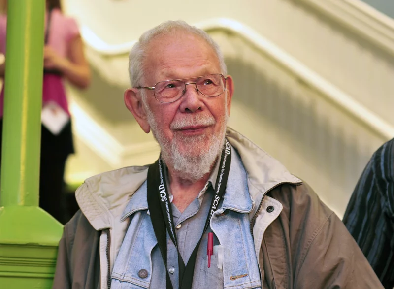

The Mad Magazine Fold-In Effect in CSS 中的疯狂杂志折叠效果

## 背景
在逛阮一峰老师的周刊时发现一篇有意思的文章推荐*CSS 折叠翻页效果*，于是就点击链接跳转到这篇文章。文章介绍如何**只使用 CSS 实现折纸一般的翻页效果**，因为它是英文的我就大致看了一下内容(看不懂)，然后直接试了一下CSS效果，感觉挺有意思的被深深的吸引住了。实际原文内容并不多，考虑到我之后再阅读、复习时的便捷，随即就产生了想要把它翻译下来的想法，就当作是一次**锻炼机会(吸收了知识，也学习了英语)**，所以就有了这篇文章😉；不希望看原文的，右侧目录点击'## 代码'；

当然我是借助翻译插件、软件进行翻译的，有`懂哥`发现译文和扩展分析存在不通畅或其它错误需要改进的地方，可以点出来，然后留言或私信告知我。文中保留了英语内容(方便学习)的方式记录这篇文章，即**英文===100%原文，中文===翻译 & 扩展分析**。全文6300+字，需要十几分钟左右阅读，但真正掌握可能还要多些时间。建议开启沉浸式阅读，开始🚀！

> 原文作者：[Thomas Park](https://github.com/thomaspark)
> 
> 原文链接：[The Mad Magazine Fold-In Effect in CSS | Thomas Park --- CSS 中的疯狂杂志折叠效果 | 托马斯公园](https://thomaspark.co/2020/06/the-mad-magazine-fold-in-effect-in-css/) 感兴趣可以去看一下。

## 简介
After 65 years at Mad Magazine, comic artist Al Jaffee **announced his retirement**. Jaffee was best known for his Mad Fold-Ins, where folding the page would reveal a hidden message in the artwork. Plenty of examples can be found on the web. The problem is, they all show the before and after statically, side by side, which diminishes the magic (see [here](https://en.wikipedia.org/wiki/Mad_Fold-in) and [here](https://13thdimension.com/13-mad-fold-ins-an-al-jaffee-celebration/)). There’s a whole generation who may have only seen the fold-ins in this format. 

在《疯狂杂志》 工作 65 年后，漫画家 AI Jaffee **宣布退休**。Jaffee 最出名的是他的疯狂折叠，折叠页面可以在艺术作品中揭示隐藏的信息。许多示例可以在网上找到。问题是，它们都静态地显示了折叠前后的效果，这减弱了其中的魔力(在[这里](https://en.wikipedia.org/wiki/Mad_Fold-in)和[这里](https://13thdimension.com/13-mad-fold-ins-an-al-jaffee-celebration/)可见)。有整整一代人可能只看过这种折叠效果的静态显示形式。

> **[疯狂杂志](https://www.madmagazine.com/)**：专门恶搞电影、小说、卡通等杂志之一。自1964年开始，每一期《疯狂杂志》的封底内页都会有一个对折的小游戏，只要将图画从A点折到B点，隐藏起图画中央的部分，一张截然不同的图画便会出现。这游戏正是读者对每期杂志引颈以待的原因；
> 
> **AI Jaffee(阿尔·贾菲)**：长期担任《疯狂杂志》漫画家，他用Fold-In的偷偷摸摸的乐趣和“愚蠢问题的活泼答案”的咆哮取悦了数百万孩子，享年102岁；
> 


## 正文
Of course I had to create the paper folding effect for the web. There’s many different ways to achieve this, but this approach is nice because：
当然，我必须为网页创作纸张折叠效果。有许多不同的方法可以实现这一点，但这种方法很不错，因为：
* It’s CSS only，relying on no JavaScript. 它只使用CSS，不依赖JavsScript。
* Uses a single image instead of requiring the image to be sliced up in Photoshop. 只使用单个图片，而不需要在 Photoshop 中对图片进行切割。 
* Can be configured with just HTML by setting CSS variables in a style attribute. 可以使用仅设置 HTML 样式属性的 CSS 变量来配置。

Here’s a demo of it in action, using artwork by Johnny Sampson **in an issue that celebrated Jaffee’s 98th birthday**. Hover or tap to fold.
这里是一个演示，使用 Johnny Sampson [在一期庆祝贾菲98岁生日](https://www.madmagazine.com/blog/2019/03/13/a-special-98th-birthday-fold-in-for-al-jaffee) 的艺术作品。**悬停** 或 **点击**可折叠。

[演示地址]()


And another by Jaffee himself.
以及另一个由 贾菲 自己创建的Fold-In作品。


## 代码
The HTML for the effect is fairly straightforward. You might be wondering about the standalone image element — it’s hidden but used to set the size and aspect ratio of the component. The image path is specified there and once again as a CSS variable to set the background image of the other elements.

该效果的HTML代码相当简单，您可能想知道独立的图像元素 —— 它是隐藏的，用于设置组件的大小和纵横比。图像路径在此处指定，又作为CSS变量来设置其它元素的背景图像。
```html
<!DOCTYPE html>
<html lang="en">

<head>
  <meta charset="UTF-8">
  <meta name="viewport" content="width=device-width, initial-scale=1.0">

  <title>The Mad Magazine Fold-In Effect in CSS</title>

  <link rel="stylesheet" href="./style.css">
</head>

<body>
  <div class="jaffee-wrapper">
    <span class="jaffee" style="--bg: url('./image/jaffee-magazine.png')">
      <span class="a"></span>
  
      <span class="bc">
        <span class="b"></span>
        <span class="c"></span>
      </span>
  
      
    </span>
  </div>
</body>

</html>
```
* `jaffee-wrapper` 外部包裹元素，为内部的3D转换提供了透视(`perspective`)效果；
* `jaffee` 是主要的折叠图像元素，这里使用了CSS变量 `--bg` 来动态传递背景图像。好处是方便更改背景图像；
* `a`、`b`和`c` 是将图像分割为三个部分的元素，用来模拟折叠效果；
* `` 元素是原始的图像，目的如上所说占位；

And here is the CSS used to set the positioning, 3D transforms, and transitions. 
这是用于设置定位、3D转换和过渡的CSS。
```css
* {
  margin: 0;
  padding: 0;
  box-sizing: border-box;
}

body {
  display: flex;
  justify-content: center;
  align-items: center;
  min-height: 100vh;
  background-color: #181c1f;
}

.jaffee-wrapper {
  /** 设置透视效果，用于创建 3D 视觉效果 */
  perspective: 60em;
}
.jaffee {
  position: relative;
  
  display: inline-flex;
  /**
    * 该元素绕 X 轴旋转 10 度，产生倾斜效果
  */
  transform: rotateX(10deg);
  /* 确保子元素位于 3D 空间中 */
  transform-style: preserve-3d;
  cursor: grab;
}

.jaffee img {
  width: auto;
  height: auto;
  max-width: 100%;
  max-height: 56vh;
  opacity: 0;
}

/* 每个分割图像的通用样式 */
.jaffee .a,
.jaffee .b,
.jaffee .c {
  top: 0;
  display: inline-block;
  height: 100%;
  background-image: var(--bg);
  background-size: cover;
  background-repeat: no-repeat;
}

.jaffee .a {
  position: absolute;
  left: 0;
  width: 50%;
  background-position: 0 0;
}

.jaffee .bc {
  position: absolute;
  left: 50%;

  display: inline-flex;
  width: 50%;
  height: 100%;
  transform-origin: left;
  transition: transform 3s;
  transform-style: preserve-3d;
}
.jaffee .b,
.jaffee .c {
  position: relative;
  width: 50%;
  /* 元素背面朝向用户时不可见 */
  backface-visibility: hidden;
}

.jaffee .b {
  background-position: 66.666667% 0;
  transform-style: preserve-3d;
}
.jaffee .b::after {
  content: "";
  position: absolute;
  top: 0;
  left: 0;
  width: 100%;
  height: 100%;
  background-color: #000;
  transform: rotateY(180deg) translateZ(1px);
  transform-style: preserve-3d;
  backface-visibility: hidden;
}

.jaffee .c {
  background-position: 100% 0;
  transform-origin: left;
  transition: transform 2s;
}

.jaffee:hover .bc,
.jaffee:active .bc {
  transform: rotateY(-180deg) translateZ(-1px);
  transition: transform 2s;
}

.jaffee:hover .c,
.jaffee:active .c {
  transform: rotateY(180deg) translateZ(2px);
  transition: transform 3s;
}
```
* 最后当用户悬停或点击 `.jaffee` 元素时，`.bc` 和 `.c` 会应用旋转和位移，模拟折叠效果。通过调整 `rotateY` 和 `translateZ` 的值，控制元素如何在3D空间中移动；

## 最后
**Mad Magazine**以其独特的艺术风格和幽默闻名。其中一个标志性的元素是`Fold-In"（折叠）`插图，这种插图在折叠和展开后会各展示出一个不同的场景或图像。而现在用CSS来模拟这种经典的视觉效果，可以达到为*读者*带来一种全新的交互体验，创造出有趣的动态效果✨；

通过在代码中添加注释，希望在读这篇文章时对你开发类似动画效果有所帮助！如果你对本文还有任何问题，欢迎在评论区留言或联系(私信)我。谢谢阅读🎉！
