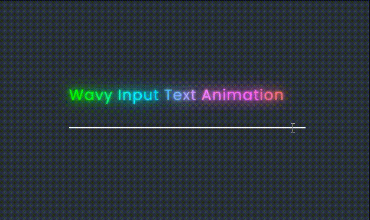

# 动感波浪「输入框」上的占位文本动画效果〰️

在本篇文章中，介绍如何使用纯`CSS`和`JavaScript`创建一个简单**漂亮的波浪输入框占位文本**动画效果。这个效果会为在输入框上添加的占位文本进行逐字显示和颜色渐变的动态效果，从而当用户在输入时获得更好的视觉反馈✨；


**<p align=center>点击使输入框聚焦/失焦以查看动画效果~</p>**

[demonstrate](https://code.juejin.cn/pen/7278239238078857275)

## HTML 结构
首先，看一下HTML结构。整个动画效果被包裹在一个具有`container`类的`div`中，该容器中包含一个`input`输入框和一个`label`标签(显示波浪动画的占位文本)；
```html
<!DOCTYPE html>
<html lang="en">
<head>
  <meta charset="UTF-8">
  <meta name="viewport" content="width=device-width, initial-scale=1.0">
  <link rel="stylesheet" href="./css/style.css">

  <title>Wavy Input Text Animation</title>
</head>
<body>
  <div class="container">
    <input type="text" required>

    <label>Wavy&nbsp;Input&nbsp;Text&nbsp;Animation</label>
  </div>
</body>
</html>
```
其文本中的HTML的字符转义`&nbsp;`："Non Breaking Space"的缩写，标识一个**空格**。具体用处是创造每个单词之间的距离的；

## JavaScript 处理
然后，为了实现看起来是逐字显示和颜色渐变的效果，现在需要使用少量`JavaScript`来处理`label`标签中的文本。下面是相应的JS代码：
```js
const label = document.querySelector(".container label");
const textList = label.innerText.split("");

label.innerHTML = textList.map((letter, i) => `<span style="transition-delay: ${i * 30}ms;filter: hue-rotate(${i * 10}deg);">${letter}</span>`).join("");
```
这段代码主要做了两件事：
* 先获取label标签，然后将label标签中的文本内容通过`split`方法转换成数组；
* 然后通过`map`方法，将数组中的每个元素（即每个字母）都转换成一个`<span>`标签，并添加`transition-delay`(字母出现的延迟事件，形成停顿感) 和 `filter`(颜色偏移°形成彩色)属性。最后设置回label标签的`innerHTML`；

## CSS 样式
接着，是一些简单的布局排版、背景色、字体色等的样式，这里就不赘述了；

值得注意的是这里：
1. 通过`CSS`伪类选择器，当**input**元素`:focus`、`:invalid`(选择任何未通过验证的表单元素，比如`input`等)，选中兄弟元素**label**并为其子元素**span**设置`color`、`text-shadow`和`transform`属性，实现了文字变绿、添加阴影和上移的效果；
2. 由于前面`JS`设置了内敛样式`filter: hue-rotate`属性，所以这些字母的颜色会显示从绿色渐变效果，是根据字母在文本中的位置`（i * 10）`来设置hue-rotate的滤镜旋转角度的，结果就是每个字母应用的是不同的颜色；
3. `span`元素的过渡效果`cubic-bezier(0.5, 1, 0.5, 1.5)`: 这是用于定义过渡速度曲线的贝塞尔函数。在本例子中，使用了4个值组成的贝塞尔函数，控制点分别是(0.5, 1)和(0.5, 1.5)它会产生一个相对缓慢的开始，然后快速加速，最后再次缓慢结束的效果，使过渡效果更加自然；
```css
* {
  margin: 0;
  padding: 0;
  box-sizing: border-box;
}

body {
  display: flex;
  justify-content: center;
  align-items: center;
  min-height: 100vh;
  background-color: #29313a;
}

.container {
  position: relative;
  width: 400px;
}

.container input {
  width: 100%;
  padding-block: 10px;
  background-color: transparent;
  border: none;
  outline: none;
  border-bottom: 2px solid #999;
  
  color: #fff;
  letter-spacing: 0.05em;
  font-size: 1.25em;
  transition: 0.5s;
}
.container input:focus,
.container input:valid {
  border-bottom-color: #fff;
}
.container input:focus ~ label span,
.container input:valid ~ label span {
  color: #0f0;
  text-shadow: 0 0 5px #0f0, 0 0 15px #0f0, 0 0 30px #0f0;
  transform: translateY(-30px);
}

.container label {
  position: absolute;
  left: 0;

  font-size: 1.25em;
  color: #666;
  user-select: none;
}
.container label span {
  display: inline-flex;
  flex-direction: row;

  font-size: 1.25em;
  letter-spacing: 0.05em;
  transition: .25s cubic-bezier(0.5, 1, 0.5, 1.5);
}
```

## 结
通过本篇文章的详细介绍，相信能够帮助你更好地使用`纯CSS`和`JavaScript`来创建一个**漂亮的波浪文本**动画，从而理解掌握和应用这个效果。其中贝塞尔函数可以给过渡效果带来一种平滑和流畅的感觉，通过逐字显示和颜色渐变，为网页提供了更加生动、有趣的输入体验⌨️。

希望这篇文章对你在开发类似交互动画效果时有所帮助！如果你对这个案列还有任何问题，欢迎在评论区留言或联系(私信)我。码字不易🥲，不要忘了三连鼓励🤟，谢谢阅读，Happy Coding🎉！

源码我放在了[GitHub](https://github.com/vnyoon/web-magic)，里面还有一些酷炫的效果、动画案列，喜欢的话不要忘了 `starred` 不迷路！
